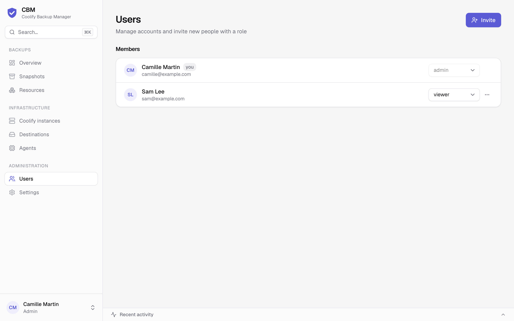
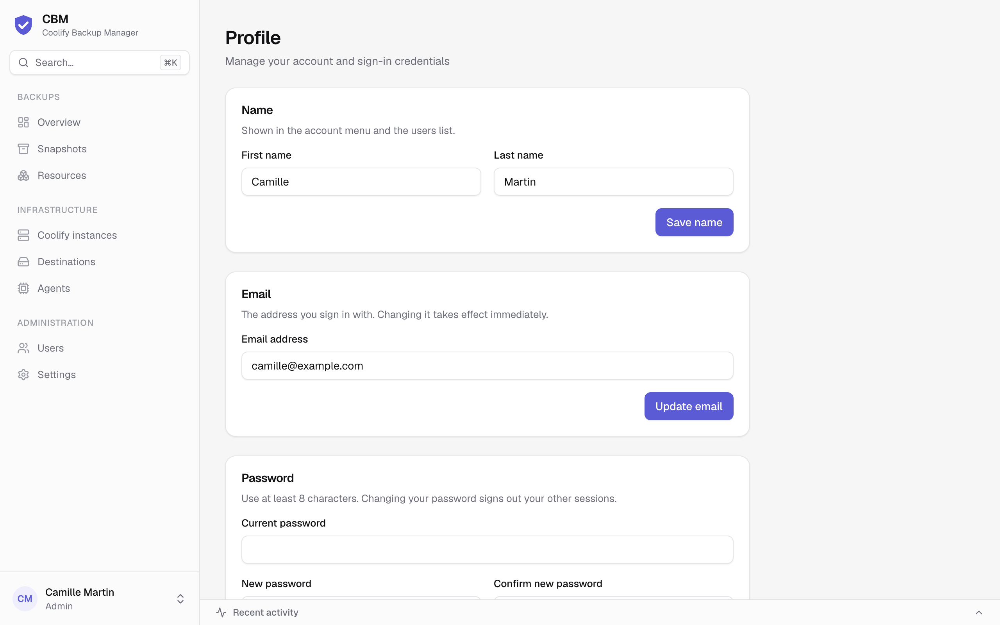

# Accounts & roles

CBM supports multiple users with three roles. Access is enforced **server-side** on every
mutating action; the UI additionally hides controls (and whole pages) a role can't use, so
people only see what they can actually do.

## The first account

The **first person to register becomes the administrator**, then public sign-up closes
automatically. Everyone else joins through an **invitation** (below) — there is no open
registration and no default password.

## Roles

Roles are cumulative: **admin ⊇ operator ⊇ viewer**.

| Capability | viewer | operator | admin |
| --- | :---: | :---: | :---: |
| View the monitoring pages (overview, snapshots, resources, instances, destinations, agents) | ✅ | ✅ | ✅ |
| Manage **your own** account on **Profile** (name, email, password) | ✅ | ✅ | ✅ |
| Run **backups** and **restores** (incl. *Back up Coolify*, retry / cancel / delete snapshots, re-pin, restore drills) | ❌ | ✅ | ✅ |
| **Verify** / **Check integrity** on a destination | ❌ | ✅ | ✅ |
| Toggle a resource's backup options (*Include in scheduled backups*, live copy) | ❌ | ✅ | ✅ |
| Edit a resource's **backup hooks** (they run arbitrary commands in its containers) | ❌ | ❌ | ✅ |
| **Connect / sync / re-point / delete** Coolify instances, reveal install commands, server mapping | ❌ | ❌ | ✅ |
| Create / test / delete **destinations**, set their mirror and weekly integrity check | ❌ | ❌ | ✅ |
| Edit **schedules** (instance, server, resource override) | ❌ | ❌ | ✅ |
| Manage **agents** (server pin, delete) | ❌ | ❌ | ✅ |
| Change **Settings** (timezone, failure alerts, SMTP, disaster recovery, restore drills, API tokens) | ❌ | ❌ | ✅ |
| Manage **users & invitations** | ❌ | ❌ | ✅ |

A **viewer** is read-only — useful for dashboards or stakeholders. An **operator** runs the
day-to-day backups and restores but can't change configuration. An **admin** configures
everything and manages the team.

> Enforcement is server-side: even a direct API call from an under-privileged session is
> rejected. The hidden buttons are a convenience, not the security boundary.

## Inviting people

As an admin, open **Users** (sidebar, *Administration*) and click **Invite**. A side panel
opens:

1. Enter the person's **email** and pick a **role** card (*viewer* is preselected).
2. Optionally turn on **Email the invite link** (disabled until SMTP works — see
   [Email](email.md)). Click **Create invite link**: either way, the **one-time link is shown
   once** for you to copy.
3. The invitee opens the link, sets their name + password, and they're in — with the role
   you chose.

Invitations are:

- **Single-use** and **expire after 48 hours**. Pending invitations are listed under the
  members on **Users**; revoke one anytime with its **×** button.
- **Bound to the email** you entered, and only the **sha256 hash** of the token is stored —
  the plaintext link can never be re-displayed.
- Gated: a signup is only accepted if it matches a **claimed, pending, unexpired** invite
  for that email (or it's the very first/admin account). Opening the link keeps that gate open
  for 10 minutes — if it lapses, the invitee just reopens the link. The gate covers social
  sign-in too (GitHub, Google or GitLab, when configured).

## Managing users

From **Users**, an admin changes anyone's **role** with the select on their row, or removes
an account from the row's **…** menu → **Delete** (type the email to confirm). Two guard
rails prevent lock-out:

- You can't **demote or delete the last remaining admin**.
- You can't delete **your own** account (another admin has to do it).

Removing a user signs out their sessions immediately; they'd need a fresh invitation to return.

## Your own account

Everyone manages their own account on **Profile** (account menu at the bottom of the sidebar):
**Name**, **Email** (the sign-in address) and **Password**. Changing the password signs out
your other sessions.

## Forgot a password?

If SMTP is configured, the sign-in page shows **Forgot password?** — it emails a reset link.
Without SMTP, an admin can simply **re-invite** the person (or set up SMTP first). See
[Email](email.md).
