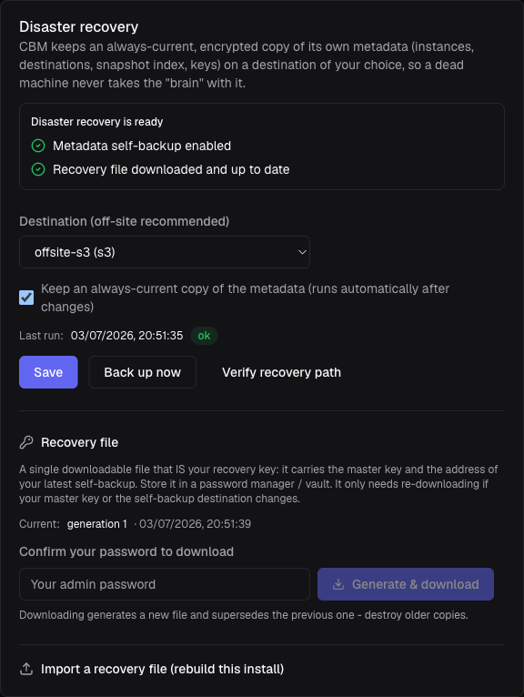

# Disaster recovery

Backing up your resources is only half of "never lose data". The other half is
surviving the loss of the **machine that runs CBM itself** — and being able to
bring everything back on new infrastructure. CBM's disaster-recovery (DR) tools
cover both.

Two things must survive a total loss:

1. **Your backup data** — already off-machine on your destinations (S3 / SSH). Use
   a remote destination, not `local` (a local folder dies with the host).
2. **CBM's own metadata** — which instances/destinations exist, the snapshot
   index, and the keys that decrypt everything. This lives only in the
   controller's database. DR protects it with a **self-backup** + a **recovery
   file**.

> **Run exactly one controller replica.** The scheduler (and the self-backup)
> runs in-process — see [installation.md](installation.md#scaling-run-exactly-one-controller-replica).

---

## 1. Self-backup (always-current metadata copy)

**Settings → Disaster recovery.** Pick an **off-site** destination (S3 or remote
SSH — `local` is refused) and enable it. From then on CBM keeps a single,
encrypted `pg_dump` of its own metadata database on that destination
(`cbm-self-backup/metadata.dump.enc`), overwritten in place:

- **No retention** — recovery always uses the latest, so one artefact is kept.
- **Change-driven + throttled** — it runs shortly after any change (throttled so
  the frequent snapshot writes don't dump every time), plus a **daily** safety
  run.
- **Alerts** — you're notified (via the failure webhook) if the self-backup fails
  or hasn't succeeded in over a day.

Use **Verify recovery path** to prove it works without a restore: CBM downloads
the latest self-backup and decrypts it, confirming it's a valid, recoverable
dump.

## 2. Recovery file (the bootstrap key)

The self-backup lives on a destination whose credentials are *inside* the very
database you'd be restoring — a chicken-and-egg you break by holding a small
**recovery file** off-machine (a password manager / vault).

**Settings → Disaster recovery → Generate & download** (admin only, and you must
re-enter your password). The file is downloaded **once** and never stored on the
server. It contains:

- your **master key**,
- the **location + credentials** of the self-backup destination (so a fresh CBM
  can fetch the latest metadata),
- an embedded copy of the metadata dump as a last-resort fallback.

Because it carries the master key, **the file _is_ the secret** — guard it. It
only needs re-downloading when your master key or the self-backup destination
changes; the page warns you when that happens. Generating a new one supersedes
the old — destroy older copies.

> Freshness comes from the **self-backup** (updated continuously), not from
> re-downloading the file. A months-old recovery file still recovers yesterday's
> state, because it points at the latest self-backup.

## 3. Restoring resources onto a fresh Coolify

Every snapshot is **self-describing**: at backup time CBM captures the full
resource definition (git repo/branch/commit, build pack, image, compose,
domains, database image + credentials, environment variables). So `Restore → new`
works even when the **source Coolify is gone** — it reconstructs from the
snapshot instead of reading the (dead) source, and it **creates any missing
project/environment** on the target. On a single-server target, every resource
lands on that server automatically; for a multi-server target, set a mapping on
the instance page.

## 4. Re-point vs migrate

Two complementary ways to send snapshots to a different Coolify (both build on
the captured config above):

- **Re-point an instance** (disaster recovery) — on the instance page, **Edit
  instance** and change the URL + API token to your new, blank Coolify. Every
  resource, snapshot and schedule keeps following that instance. Then re-run the
  agent install command on the new host.
- **Restore onto another instance** (migration) — when several Coolify instances
  are connected, `Restore → new` offers a **"Restore onto"** picker, so you can
  clone a backup from one Coolify onto another.

---

## End-to-end recovery runbook

Machine (Coolify + CBM) is gone. To fully recover:

1. **New CBM.** `docker compose up -d` a fresh controller — a new `MASTER_KEY` is
   fine (the recovery file carries the old one).
2. **Import the recovery file.** Settings → Disaster recovery → *Import*. CBM
   fetches the latest self-backup from its destination, restores it, and
   re-encrypts every secret under the new install's master key. You are signed
   out — **sign back in with your OLD credentials** (the imported accounts).
3. **Re-point the instance** at your new, blank Coolify (Edit instance).
4. **Re-install the agent** on the new Coolify host (same per-instance install
   command). The agent auto-detects its server; on a brand-new empty host where
   it can't yet, set the server on the **Agents** page or pass
   `AGENT_SERVER_UUID` at install (see [multi-server.md](multi-server.md)).
5. *(Multi-server)* set the server map on the instance.
6. **Restore → new** each resource. CBM recreates the project/environment,
   reconstructs the resource from the captured config (pinned commit/image),
   re-injects env + database credentials, and the agent restores the data. The
   source Coolify being dead no longer matters.
7. Verify and deploy.

> **Requirements.** DR needs a **non-`local` destination** for the self-backup,
> and the controller image ships the PostgreSQL client used for the dump/restore.
> After importing, the self-backup destination is re-used automatically; its next
> run overwrites the artefact under the new master key.

## Test it before you need it

Do a **dry run**: generate a recovery file, stand up a throwaway CBM with a
*different* master key, import the file, and confirm your instances, destinations
and snapshots come back and that a destination still connects. That drill is the
only real proof your recovery works.
