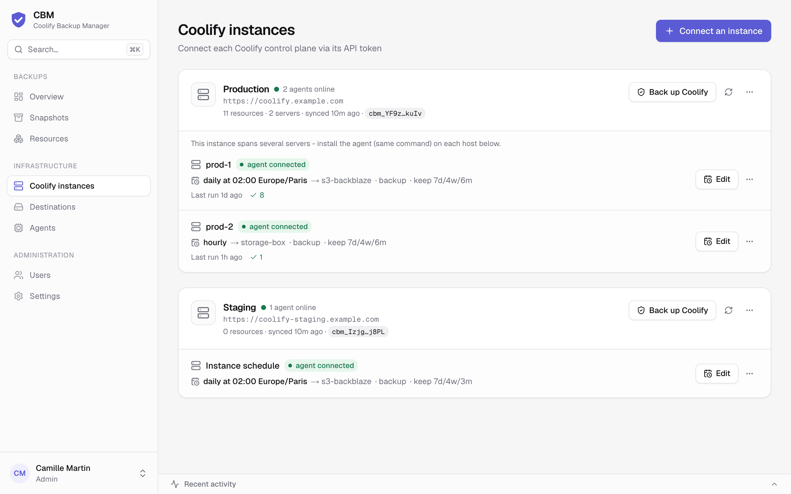

# Installation

CBM has two pieces:

- **Controller** — the web panel + API + scheduler + metadata database. One per deployment.
- **Agent** — a small container on each Docker host that does the actual backups. One per host.

Both run from published images: `ghcr.io/holo795/cbm-controller` and `ghcr.io/holo795/cbm-agent`.

---

## 1. Run the controller

### Option A — Docker Compose (anywhere)

```bash
curl -fsSLO https://raw.githubusercontent.com/Holo795/CBMCoolifyBackup/main/docker-compose.yml
curl -fsSLO https://raw.githubusercontent.com/Holo795/CBMCoolifyBackup/main/packages/controller/.env.example
mv .env.example .env
```

Edit `.env` and set at least:

```dotenv
BETTER_AUTH_URL=https://cbm.example.com        # the public URL you open in the browser
BETTER_AUTH_SECRET=<a long random string>       # openssl rand -hex 32
MASTER_KEY=<base64 32 bytes>                     # node -e "console.log(require('crypto').randomBytes(32).toString('base64'))"
```

Then:

```bash
docker compose up -d
```

The controller runs database migrations automatically on start. Put it behind a reverse
proxy / TLS for production (the compose file `expose`s port 3000).

### Option B — Deploy on Coolify itself

Add this repository to Coolify as an application using `Dockerfile.controller` (or as a
docker-compose resource), attach a PostgreSQL database, and set the same environment
variables. CBM happily backs up the very Coolify it runs on.

See **[Configuration](configuration.md)** for the full variable reference.

> ⚠️ **Keep `MASTER_KEY` safe and backed up.** It encrypts every stored secret (and, with the
> restic engine, your backups). If you lose it, encrypted data is unrecoverable.

---

## 2. First run — create the admin

Open your `BETTER_AUTH_URL` and **register**. The **first account to register becomes the
administrator**, and public sign-up closes automatically afterwards. There is no seed user and
no default password.

To add teammates, use **Users → Invite** with a role (admin / operator / viewer) — see
[Accounts & roles](accounts.md). For password-reset and verification emails, set up SMTP in
**Settings → Email (SMTP)** ([Email](email.md)).

---

## 3. Connect Coolify



In the UI: **Coolify instances → Connect an instance** (in the page header), and enter:

- a **name** for the instance (e.g. `production`),
- the Coolify **base URL** (e.g. `https://coolify.example.com`),
- a Coolify **API token** (Coolify → Keys & Tokens → API tokens, read access is enough to
  discover resources; write access is needed for "restore → new" which creates resources).

**Connect & sync** saves it, syncs the instance and lists its resources. The sync button on the
instance card re-syncs on demand; the card's **…** menu also holds **Re-point the instance**
(point it at another Coolify) and **Delete** (type the instance name to confirm).

---

## 4. Install an agent on each Docker host

On the instance card, open the **…** menu → **Install command**, then click **Reveal install
command** to get the enrollment token (shown once; revealing again rotates it), and run the
one-liner **on each host** you want to back up:

```bash
curl -fsSL https://cbm.example.com/install.sh | CBM_TOKEN=cbm_… sh
```

On a host whose DNS resolver is unreliable, give the agent its own DNS servers (passed to
`docker run --dns`):

```bash
curl -fsSL https://cbm.example.com/install.sh | AGENT_DNS="1.1.1.1 9.9.9.9" CBM_TOKEN=cbm_… sh
```

This starts the `cbm-agent` container with:

- the Docker socket mounted (`/var/run/docker.sock`) — required to dump/freeze/inspect,
- a persistent `/backups` volume (used by "local" destinations),
- a `cbm-agent-work` volume for its work dir (`/var/lib/cbm-agent`): staging stays off the
  container's own layer, and its pending results and its record of the containers it paused
  survive a reinstall (the next agent resumes anything an interrupted job left paused or stopped),
- the enrollment token, which it exchanges for a bearer token on first start.

The agent is installed **directly** (not through the Coolify API) because Coolify's deploy
path would strip the Docker socket mount the agent needs. Re-running the command reconfigures
the agent in place. The agent shows up on the **Agents** page within ~30s.

In a **multi-server** Coolify instance, run it once per server — each agent auto-detects which
Coolify server it serves. See [Multi-server](multi-server.md).

---

## 5. Configure backups

- **Destinations → Add a destination** → where backups are stored (local / SSH-SFTP / S3,
  standard (tar) or restic engine).
- **Resources** → toggle "Include in scheduled backups" per resource.
- **Coolify instances** → **Set** on the instance's schedule row (one row per server in a
  multi-server instance) → frequency, mode, destination and retention, in a side panel. A
  resource can override it from its **Schedule** tab.

You're done. See [Backups](backups.md) for what gets captured and how.

---

## Updating

Pull the new images and restart:

```bash
docker compose pull && docker compose up -d        # controller (migrations run on start)
```

For agents, re-run the install command on each host (it recreates the container with the
latest image), or `docker pull ghcr.io/holo795/cbm-agent:latest` then recreate `cbm-agent`.

---

## Scaling: run exactly one controller replica

The controller runs the backup **scheduler in-process**. Running two or more
controller replicas against the same database would double-fire scheduled
backups (and the metadata self-backup). Deploy a **single controller replica**;
scale by giving it more resources, not more replicas.

As a backstop, the scheduler takes a Postgres advisory lock at startup, so if a
second replica is started by accident only one of them runs scheduled work — but
this is a safety net, not a supported HA mode.
