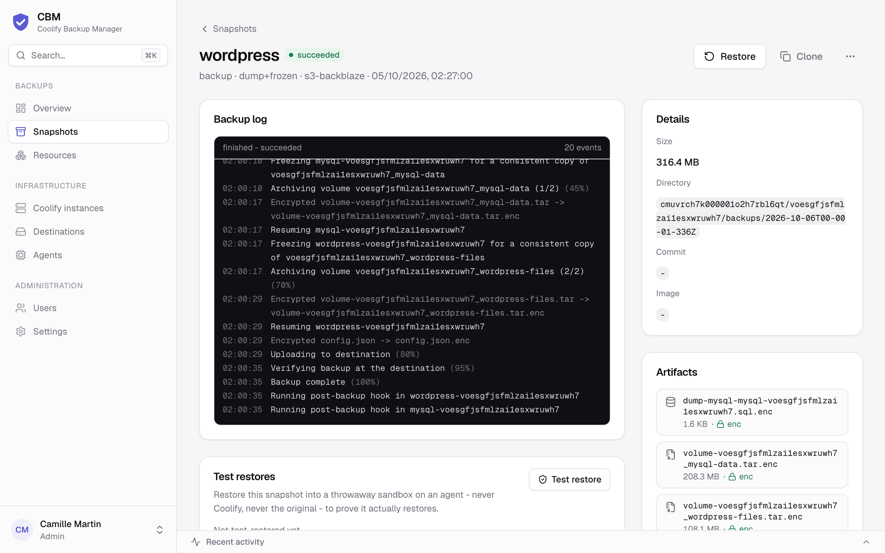

# Restore

From any successful snapshot you can restore **in place** (**Restore**) or **to a new resource**
(**Clone**). Both buttons sit on each succeeded row of **Snapshots** and in the header of the
snapshot's page (operator+, and they need a live agent on the instance). Each asks for
confirmation, then opens the snapshot's page so you can follow the restore log live; past restores
are listed in its **Restores** card.

> **A clone has no data of its own.** Coolify clones the *configuration*, not the contents — a
> freshly cloned resource starts empty. The data always comes from the snapshot (a logical dump
> loaded into the container, or a volume copy written into the resource's volume).

## In place

Overwrites the existing resource's data with the snapshot:

- **Database dumps** are loaded into the running container — **no downtime**.
- **Volumes** require a brief stop: the agent stops the containers, overwrites the volume,
  then restarts them.
- **Redis** RDB snapshots are written into the data volume and loaded on restart.
- **Service-internal databases** are additionally re-loaded from their logical dump after the
  containers are back up (best-effort, on top of the volume restore).

A *configuration only* snapshot (a resource with no volume, host folder or database — see
[Backups](backups.md#resources-with-nothing-to-copy)) has no data to put back: it offers **Clone**
only, and isn't test-restored.

## → new (clone)

**Clone** creates a **brand-new Coolify resource** and restores into it — the original is never touched.
Works for all types:

- **Databases** (dump engines) — the clone is deployed and the dump is loaded into it.
- **Redis / volume databases** — the clone's (uuid-remapped) volumes are pre-filled.
- **Git applications** — the captured **commit is re-pinned** so the code matches the data.
- **Docker-image applications** — the **exact image tag** captured at backup time (a floating
  tag like `latest` is cloned as a digest-pinned service so it runs the same image).
- **Docker-compose services** — every volume is pre-filled under the clone's names, mounted on
  first deploy.

For apps and services, the clone is created **but not deployed** by default (no domain, by
design) — you review it in Coolify, then deploy. Its data is already in place: an application's
named volumes are recreated on the clone and filled. Environment variables captured in the
snapshot are applied to the clone automatically, including the credentials Coolify generated
for a service (`SERVICE_USER_*` / `SERVICE_PASSWORD_*`), since its restored database was created
with them; domains are not copied.

The Coolify **control plane** ("Back up Coolify") can only be restored in place — its snapshots
have no **Clone** button.

Because each snapshot also captures the **full resource definition** (git/build pack, image,
compose, domains, database credentials), `→ new` works even when the **source Coolify is gone**,
and it **creates any missing project/environment** on the target. When several Coolify instances
are connected, the **Clone** dialog offers a **Restore onto** select, so you
can clone the snapshot onto a *different* Coolify (migration). See **[disaster-recovery.md](disaster-recovery.md)**.

### Restoring a whole stack: references are rewired

Coolify containers reach each other by a hostname derived from the resource uuid — an app's
`DATABASE_URL` looks like `postgres://app:pw@<db-uuid>:5432/app`. A plain clone keeps those values,
so a restored app would still talk to the **original** database: a test copy writing to production.

To avoid that, when you restore an app or service **→ new**, CBM rewires its environment so any
reference to a resource you've **already restored → new on the same instance** points at that
clone instead of the original. Every rewired variable is listed in the restore log
(`Rewired DATABASE_URL: <original> -> <clone>`).

- **Restore the data tier first** (databases, caches), then the apps that use them — rewiring
  happens when the app is cloned, so the database clone must already exist.
- Only resources restored → new are rewired. An app restored on its own still points at the live
  originals, as before.
- If a resource was restored several times, the newest clone that still exists is used. Delete
  test clones you no longer need so a later restore doesn't pick them up.
- Only env values are rewired (not compose files).

## With the restic engine

Restore is transparent: the agent pulls the exact snapshot from the restic repository (local,
S3, or SSH/SFTP — including a jump host), then applies it exactly like the tar engine. Both
in-place and → new are supported.

---

## Test restores (restore drills)

A backup you've never restored is a hope, not a backup. A **test restore** proves a snapshot is
actually restorable — without touching Coolify or the original resource:

1. An agent fetches the snapshot back to plaintext (exactly the path a real restore uses —
   restic or tar, decrypting encrypted artifacts).
2. Each artifact is restored into a **throwaway sandbox on that agent**:
   - **PostgreSQL / MySQL / MariaDB / MongoDB dumps** are loaded into a fresh container of the
     same engine — the exact image recorded at backup time when available — running with
     **no network at all** and random credentials. CBM then checks that every table declared in the
     dump exists after the load (`restored 12/12 tables`); MongoDB reports its collections.
   - **Redis RDB exports** are loaded by a throwaway `redis-server` (key count reported). KeyDB and
     Dragonfly exports get an RDB header check.
   - **Volume and bind-mount archives** are read back end to end.
3. Everything is deleted afterwards; sandboxes left behind by a crashed agent are cleaned up by the
   next drill.

Run one from a snapshot's page (**Test restore** in its *Test restores* card or its "…" menu,
operator+), via the API
(`POST /api/v1/snapshots/:id/drill`) or the MCP tool `cbm_test_restore`. Turn on **Settings →
Restore drills** to test each backup-enabled resource's latest snapshot every week (Saturday 05:00);
each snapshot is drilled once, and a drill that couldn't run (agent offline) is retried. A failed
drill sends an alert. The snapshot's *Test restores* card keeps every drill with its per-artifact
checks, and the snapshots list shows a shield badge on tested snapshots (hover it for the result:
restore verified, failed, or did not run).

What a drill does **not** prove: that Coolify can redeploy the application around the data. For
that, an occasional real **→ new** restore is still the ultimate check.
